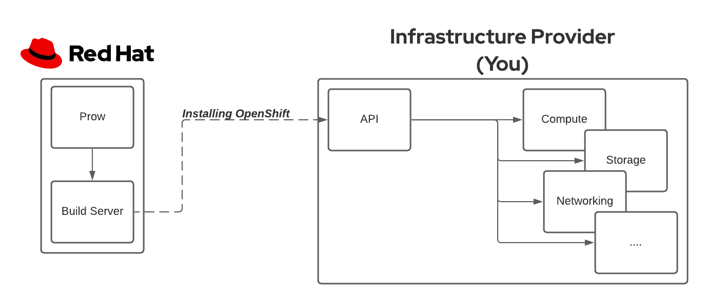
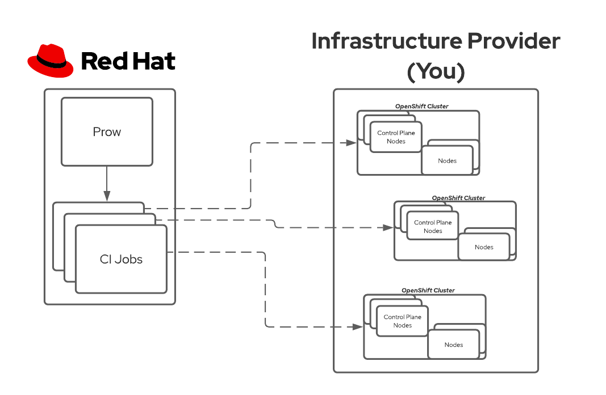

# Continuous Integration and Testing

Continuous Integration (CI) testing for OpenShift and its supported infrastructure providers is handled through Prow; the same system used for the Kubernetes project. The landing page for OpenShift's CI can be found [here](https://docs.ci.openshift.org), but we'll add some context for you as a newly supported OpenShift infrastructure provider.

Some of the CI components will be hosted by you and some hosted by Red Hat. We'll start by looking at what you should have.

## Your Infrastructure

You, as the infrastructure provider, will supply infrastructure where test OpenShift clusters will be installed and end-to-end (e2e) tests will be executed.

The requirements vary from provider to provider. For example, VMWare and AWS are hosted very differently (on-premise vs hosted) so each one has caveats. But, there are some common requirements. 

- API endpoint[s] for your service. 
    - i.e. What does your CLI or terraform communicate with to provision infrastructure?
- User accounts with required permissions for OpenShift installation.
    - i.e. Can you share credentials that Red Hat can use to provision in your infrastructure?
- Ability to run multiple OpenShift clusters.
    - i.e. Do you have enough resources to run multiple OpenShift clusters? More on this below. 
- Network infrastructure including:
    - DHCP
    - Load balancing (Layer 4)
    - Gateways and/or bastions for possible user access
- Sufficient storage for multiple OpenShift clusters.

It is important to note that you will need to be able to run multiple OpenShift clusters at a time on your infrastructure. Why? Each code change related to your infrastructure provider will need to run unit and e2e tests. The e2e tests require an isolated OpenShift cluster so tests can run without interference. Its very likely to have more than one code change in flight at a time so having the ability to run multiple OpenShift clusters is necessary to quickly provide the test results to the engineers.

In order to calculate your infrastructure size and costs, use this [OpenShift Minimum Hardware Requirements document.](https://docs.openshift.com/container-platform/4.9/installing/installing_bare_metal/installing-bare-metal.html#minimum-resource-requirements_installing-bare-metal)

## Red Hat's Infrastructure

Red Hat will host a cluster where Prow Jobs are run. These Prow Jobs will execute many steps which include infrastructure setup, provisioning a cluster on your infrastructure, running tests, and deprovisioning. The steps are a part of a chain and workflow (see [here](https://docs.ci.openshift.org/docs/architecture/step-registry/)).

This Red Hat hosted cluster will need to be able to communicate with you so that it can run these steps, so some account and networking setup may be necessary.

## Connecting with OpenShift CI

In each of the sections below, the outbound links contain examples of the code changes and pull requests.

### Create Cluster Profile

Creating your Cluster Profile for OpenShift's CI is a major stepping stone to running CI jobs. Details on how to do this can be found here: https://docs.ci.openshift.org/docs/how-tos/adding-a-cluster-profile/. Red Hat will work with you to complete each of the steps since they will require review and code merges into the OpenShift CI system.

Note that in the [Providing Credentials](https://docs.ci.openshift.org/docs/how-tos/adding-a-cluster-profile/#providing-credentials) step, you should work with Red Hat on how to access the Vault used for OpenShift CI. 

### Adding to CI Step Registry

OpenShift CI jobs are composed of multiple workflows and steps. You will need to add these to complete the integration with OpenShift CI. Documentation on creating workflows and steps can be found [here](https://docs.ci.openshift.org/docs/architecture/step-registry/). The registry of steps can be found [here](https://github.com/openshift/release/tree/master/ci-operator/step-registry). Finally, an auto-generated document of all existing workflows, chains, and steps can be found [here](https://steps.ci.openshift.org/) and is a great reference. 

Make sure that you have steps for each method of installation. For example, CI steps for UPI, IPI, disconnected network installations, or any other types. 
